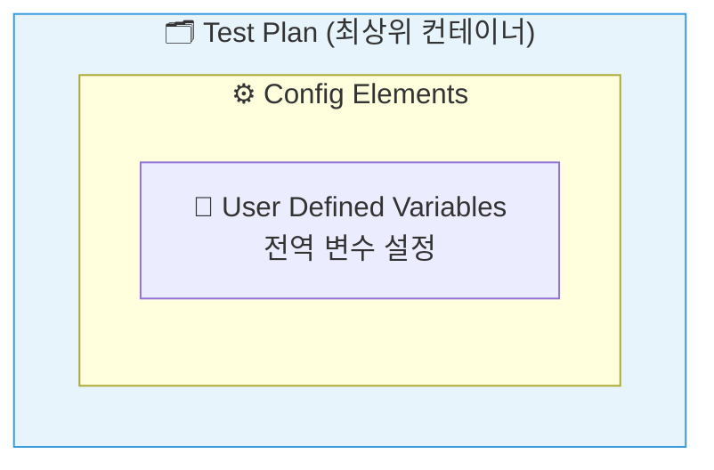
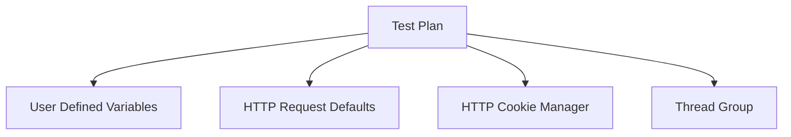
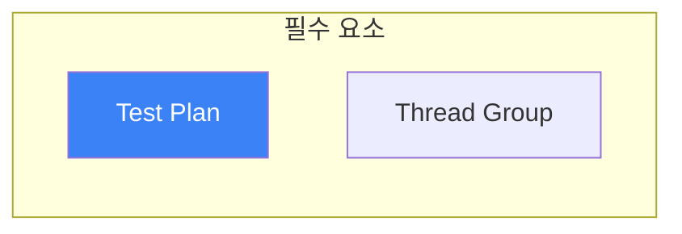
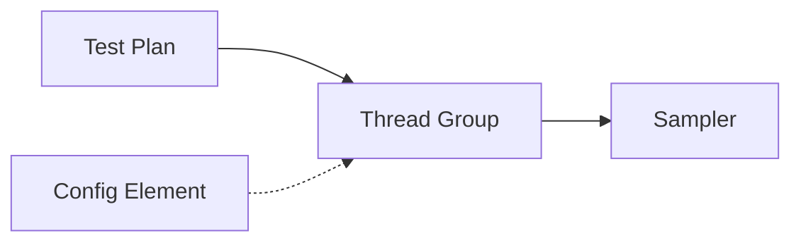

# Mermaid 다이어그램 문법 오류 수정

## 오류 현상
- Mermaid version 11.12.2에서 "Syntax error in text" 발생
- 기본 계층 구조 다이어그램 렌더링 실패
- 구성 요소 관계도 다이어그램 렌더링 실패

## 오류 원인

Mermaid 11.x 버전에서 이전 버전과의 호환성 문제 발생:

| 문제 요소 | 설명 |
|----------|------|
| subgraph 구문 | 중첩된 subgraph 또는 복잡한 subgraph 구문 파싱 실패 |
| 이모지 | 노드 라벨 내 이모지 문자 처리 오류 |
| HTML 태그 | 노드 내 `<br/>` 등 HTML 태그 파싱 오류 |
| style 정의 | 인라인 style 문법 변경 |
| 따옴표 미사용 | 특수문자 포함 라벨에서 따옴표 필수 |

## 수정 내용

### 1차 수정 (부분 해결)
```
- 이모지 제거
- 노드 내 <br/> 태그 제거
- style 정의 제거
- 서브그래프명 단순화
```

### 2차 수정 (완전 해결)
```
- subgraph 구문 전체 제거
- graph TB → graph TD 변경
- 모든 노드 라벨에 따옴표 추가
- 변수명 단순화
```

## 수정 전후 비교

### 기본 계층 구조 다이어그램

**수정 전 (오류 발생):**


**수정 후 (정상 작동):**


### 구성 요소 관계도

**수정 전 (오류 발생):**


**수정 후 (정상 작동):**


## Mermaid 11.x 호환 가이드라인

향후 Mermaid 다이어그램 작성 시 준수사항:

| 항목 | 권장 | 비권장 |
|------|------|--------|
| 그래프 타입 | `graph TD`, `flowchart LR` | `graph TB` (일부 환경 문제) |
| 노드 라벨 | `["텍스트"]` 따옴표 사용 | `[텍스트]` 따옴표 미사용 |
| 특수문자 | 영문/숫자 위주 | 이모지, 괄호, 특수기호 |
| 서브그래프 | 단순 구조만 사용 | 중첩 서브그래프 |
| 스타일 | 별도 CSS 클래스 | 인라인 style 정의 |
| 줄바꿈 | 별도 노드로 분리 | `<br/>` 태그 |

## 수정된 파일

- `/Users/mac/ws/qwen/jmeter-onboard/content/test-plan-components.md`

## 수정일
2026-02-02
