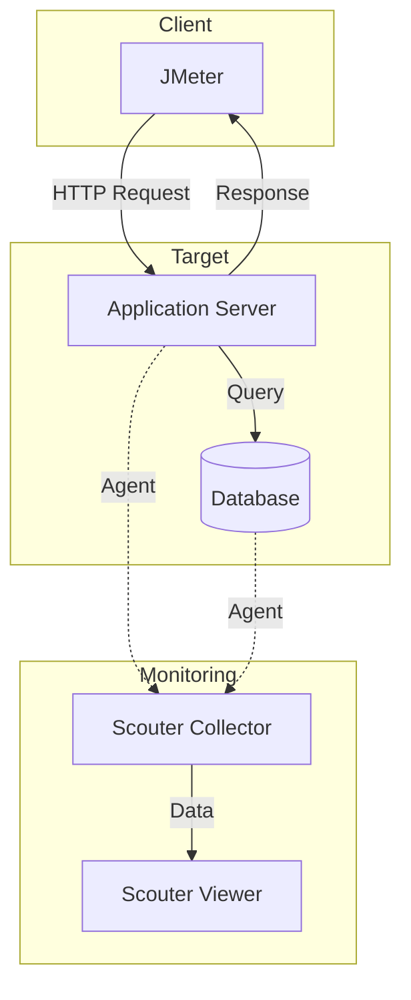
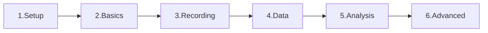

# Introduction to JMeter and Scouter

JMeter와 Scouter를 연동하여 성능 테스트 환경을 구축하는 것은 실무에서도 매우 자주 쓰이는 시나리오입니다. 이 가이드는 JMeter와 Scouter를 함께 사용하여 효과적인 부하 테스트를 수행하는 방법을 안내합니다.

---

## JMeter와 Scouter 연동 구조

---

## 학습 로드맵

이 가이드는 성능 테스트의 기초부터 고급 기능까지 단계별로 학습할 수 있도록 구성되어 있습니다.

---

## 콘텐츠 전체 구조

### 1단계: 환경 구축 (Setup & Installation)

| 주제 | 설명 |
|------|------|
| **Installation** | JMeter 설치 및 초기 설정 |
| **Folder Structure** | JMeter 폴더 구조 이해 |
| **Environment Setup** | 테스트 환경 구성 |

### 2단계: 기본 개념 (Basic Concepts)

| 주제 | 설명 |
|------|------|
| **Test Plan Components** | 테스트 계획의 구성 요소 |
| **Thread Group Guide** | 가상 사용자 설정 방법 |
| **Block Coding** | 블록 코딩 접근법 |
| **Constant Timer** | 요청 간 대기 시간 설정 |

### 3단계: 레코딩 (Recording)

| 주제 | 설명 |
|------|------|
| **Recording Feature** | HTTP(S) 요청 녹화 기능 |
| **Templates** | 템플릿 활용 |
| **Proxy Setting** | 프록시 설정 |
| **Firefox Recording** | Firefox 브라우저 녹화 |
| **Firefox HTTPS Recording** | HTTPS 녹화 설정 |
| **HAR File Method** | HAR 파일 활용 방법 |

### 4단계: 테스트 시나리오 (Test Scenarios)

| 주제 | 설명 |
|------|------|
| **Cart Scenario** | 장바구니 시나리오 |
| **Full Shopping Cart** | 전체 쇼핑 시나리오 |
| **Transaction Control** | 트랜잭션 컨트롤러 |

### 5단계: 데이터 처리 (Data Handling)

| 주제 | 설명 |
|------|------|
| **Data Parameterization** | 데이터 파라미터화 |
| **CSV Data Set Config** | CSV 데이터 설정 |
| **CSV Sharing Mode** | CSV 공유 모드 |
| **Login Data CSV** | 로그인 데이터 처리 |

### 6단계: 스레드 및 부하 제어 (Threading & Load Control)

| 주제 | 설명 |
|------|------|
| **Ultimate Thread Group** | 고급 스레드 그룹 |
| **Pacing Controller** | 페이싱 컨트롤러 |
| **Constant Throughput Timer** | 일정 처리량 타이머 |
| **Load Generator Users** | 부하 생성기 사용자 수 |

### 7단계: 검증 및 추출 (Validation & Extraction)

| 주제 | 설명 |
|------|------|
| **Response Assertion** | 응답 검증 |
| **Correlation** | 상관관계 처리 |
| **Regex Extractor** | 정규식 추출기 |

### 8단계: 결과 분석 (Results & Analysis)

| 주제 | 설명 |
|------|------|
| **View Results Tree** | 결과 트리 보기 |
| **Summary Report** | 요약 보고서 |
| **Response Time Graph** | 응답 시간 그래프 |
| **Distributed Testing Guide** | 분산 테스트 가이드 |

### 9단계: 시스템 모니터링 (System Monitoring)

| 주제 | 설명 |
|------|------|
| **Scouter Introduction** | Scouter 소개 |
| **PerfMon Collector** | 성능 모니터 수집기 |
| **Sysinternals Suite** | 시스템 도구 모음 |

### 10단계: 고급 기능 (Advanced)

| 주제 | 설명 |
|------|------|
| **Performance Theory TPS** | TPS 성능 이론 |
| **Test Fragment** | 테스트 프래그먼트 |
| **Once Only Controller** | 한 번만 실행 컨트롤러 |
| **JMeter vs k6** | 도구 비교 |

---

## JMeter와 Scouter 역할 비교

| 구분 | JMeter | Scouter |
|------|--------|---------|
| **관점** | 외부 (클라이언트) | 내부 (서버) |
| **측정** | 응답 시간, TPS, 에러율 | CPU, 메모리, DB 쿼리 |
| **목적** | 부하 생성 및 성능 측정 | 서버 상태 모니터링 |
| **분석** | 사용자 관점 성능 | 서버 병목 지점 |

---

## 성능 테스트 워크플로우

| 단계 | 활동 | 관련 콘텐츠 |
|------|------|-------------|
| **Plan** | 테스트 계획 수립 | Test Plan Components |
| **Record** | HTTP 요청 녹화 | Recording Feature |
| **Parameterize** | 데이터 변수화 | CSV Data Set Config |
| **Validate** | 응답 검증 설정 | Response Assertion |
| **Execute** | 부하 테스트 실행 | Thread Group Guide |
| **Analyze** | 결과 분석 | Summary Report |
| **Report** | 보고서 작성 | Response Time Graph |

---

## 빠른 시작 가이드

:::info
**처음 시작하시나요?** 다음 순서로 학습하세요:
1. Installation → 2. Test Plan Components → 3. Thread Group Guide → 4. Recording Feature → 5. View Results Tree
:::

**JMeter 핵심 기능:**
- 가상 사용자 생성 (Thread Group)
- HTTP 요청 전송 (HTTP Request Sampler)
- 응답 시간 측정 (Listener)
- Throughput 계산 (Summary Report)

**Scouter 핵심 기능:**
- CPU/메모리 모니터링
- Active Service 추적
- 느린 쿼리 감지
- 실시간 XLog 분석
