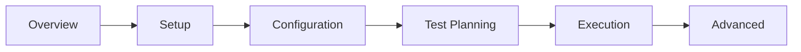
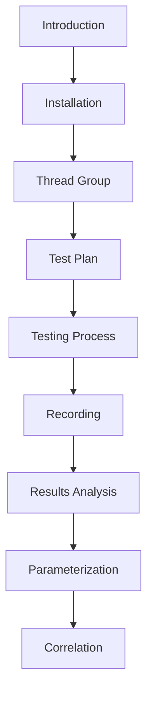
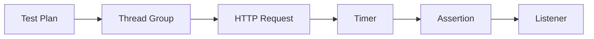
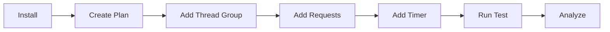
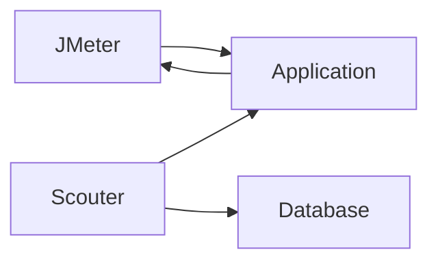

# Introduction to JMeter and Scouter

JMeter와 Scouter를 연동하여 성능 테스트 환경을 구축하는 것은 실무에서도 매우 자주 쓰이는 시나리오입니다. 이 가이드는 JMeter와 Scouter를 함께 사용하여 효과적인 부하 테스트를 수행하는 방법을 안내합니다.

---

## Learning Roadmap

---

## Content Connection Map

---

## Topic Categories

---

## JMeter Workflow

---

## JMeter and Scouter Integration

---

## Learning Path

### Essential Topics

| Step | Topic | Description |
|------|-------|-------------|
| 1 | Introduction | JMeter/Scouter Overview |
| 2 | Installation | Setup Environment |
| 3 | Test Plan Components | Plan Structure |
| 4 | Thread Group Guide | Virtual Users |
| 5 | Testing Process | Run Tests |
| 6 | View Results Tree | Check Results |

### Advanced Topics

| Step | Topic | Description |
|------|-------|-------------|
| 1 | Recording Feature | Record HTTP Requests |
| 2 | Data Parameterization | CSV Data Handling |
| 3 | Correlation | Dynamic Value Extraction |
| 4 | Test Fragment | Reusable Modules |

---

## Overview

JMeter는 부하 테스트 도구로, 가상의 사용자를 만들어 서버에 요청을 보내고 성능 지표를 수집합니다. 반면, Scouter는 서버 내부에서 성능을 모니터링하는 도구로, CPU, 메모리, 느린 DB 쿼리 등을 감시합니다.

이 두 도구를 함께 사용하면 외부에서의 성능 지표와 내부 서버 상태를 모두 확인할 수 있어, 병목 지점을 정확히 파악할 수 있습니다.

**JMeter 역할:**
- 가상 사용자 생성
- HTTP 요청 전송
- 응답 시간 측정
- Throughput 계산

**Scouter 역할:**
- CPU/메모리 모니터링
- Active Service 추적
- 느린 쿼리 감지
- 실시간 XLog 분석
