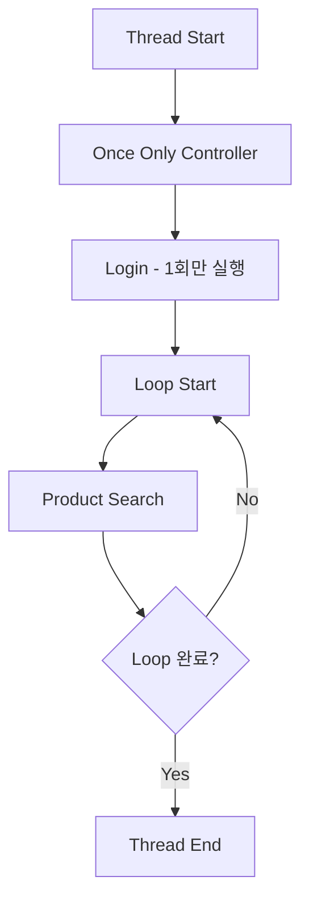
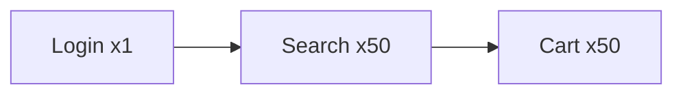
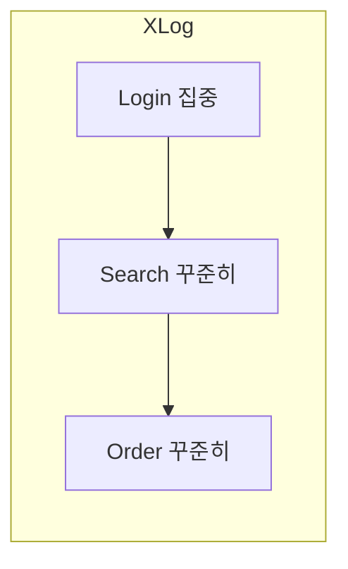

# Once Only Controller

Once Only Controller는 여러 번 반복되는 부하 테스트 시나리오 내에서 **"특정 동작을 딱 한 번만 실행"**하고 싶을 때 사용하는 제어 요소입니다.

주로 반복적인 루프(Loop) 내에서 로그인을 한 번만 수행하거나, 초기 환경 설정 데이터를 불러올 때 필수적으로 사용됩니다.

---

## 작동 원리



---

## 1. 주요 기능 및 작동 원리

| 항목 | 설명 |
|------|------|
| 동작 | Thread가 여러 번 반복해도 첫 번째 루프에서만 실행 |
| 스코프 | Loop Count가 10이면 1회 실행, 9회는 건너뜀 |
| 주의 | 전체 사용자 중 1번이 아니라 각 Thread당 1번 실행 |

**중요:** 100명의 사용자로 테스트하면 로그인은 총 100번 발생합니다 (사용자당 1번).

---

## 2. 실무 활용 사례

### 로그인 (가장 대표적인 케이스)

부하 테스트 시나리오가 `로그인 -> 상품조회(반복) -> 장바구니(반복)`인 경우, 매번 조회할 때마다 로그인을 다시 할 필요는 없습니다.

**구조:**
```
Thread Group (Loop Count: 50)
├── Once Only Controller
│   └── HTTP Request (Login)
└── HTTP Request (Product Search)
```

**결과:** 사용자는 처음에 한 번 로그인하고, 세션을 유지한 채 상품 조회만 50번 반복합니다.



### 초기 데이터 로딩 및 공통 변수 설정

테스트 시작 시 서버로부터 특정 토큰을 받아오거나, 공통 설정값을 한 번만 호출해야 할 때 유용합니다.

**활용 예시:**
- OAuth 토큰 발급
- 초기 설정값 로드
- 테스트 데이터 준비

---

## 3. 설정 시 주의사항

### 위치에 따른 동작 차이

Once Only Controller가 Loop Controller 내부에 있더라도, 해당 루프가 돌 때마다 실행되는 것이 아니라 **전체 Thread 생명주기 동안 첫 번째 루프에서만** 작동합니다.

### 로그인 유지 (Cookie Manager)

로그인을 한 번만 하려면 반드시 **HTTP Cookie Manager**가 함께 있어야 합니다.

```
Thread Group
├── HTTP Cookie Manager  ← 필수!
├── Once Only Controller
│   └── HTTP Request (Login)
└── HTTP Request (Other Requests)
```

첫 번째에 획득한 세션 정보가 이후 반복되는 요청들에도 유지됩니다.

---

## 4. t3.medium 실습 및 Scouter 분석 팁

### Scouter에서의 관찰

Once Only Controller를 사용하면 Scouter XLog 상에서:
- **로그인 서비스**: 테스트 시작 직후에만 집중적으로 찍힘
- **메인 비즈니스 로직**: 조회, 주문 등이 꾸준히 찍힘



### 부하 효율성

| 방식 | 문제점 |
|------|--------|
| 매번 로그인 반복 | 인증 로직에 과도한 부하, 실제 측정 대상 가려짐 |
| Once Only 사용 | 로그인과 비즈니스 로직 분리, 정확한 성능 측정 가능 |

---

## 5. 전체 딱 한 번이 필요하다면?

모든 사용자를 통틀어 정말 **딱 한 번만** 실행해야 하는 동작이 있다면:

| 요구사항 | 해결책 |
|----------|--------|
| 각 사용자당 1번 | Once Only Controller |
| 전체 테스트에서 1번 | setUp Thread Group |

**setUp Thread Group 활용 예시:**
- 공통 테이블 초기화
- 테스트 환경 준비
- 전역 변수 설정

```
Test Plan
├── setUp Thread Group  ← 테스트 시작 전 1회 실행
│   └── HTTP Request (Initialize)
└── Thread Group (Main Test)
    └── ...
```

---

## 요약

| 항목 | 내용 |
|------|------|
| 용도 | 반복 루프 내에서 특정 동작 1회만 실행 |
| 대표 사례 | 로그인, 토큰 발급, 초기 설정 |
| 실행 단위 | Thread당 1회 (전체 1회 아님) |
| 필수 조합 | HTTP Cookie Manager (세션 유지) |
| 전체 1회 필요시 | setUp Thread Group 사용 |
