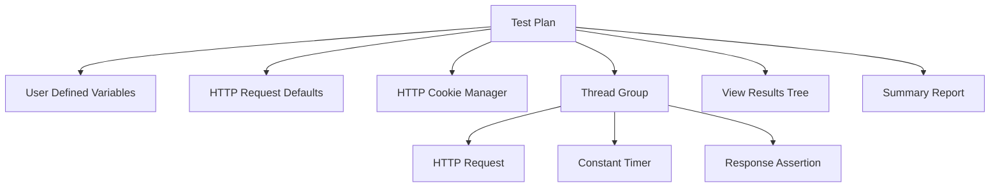
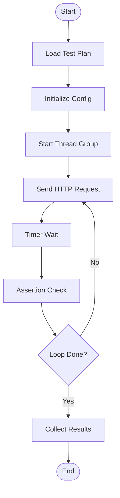
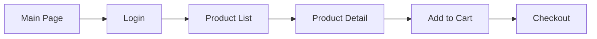
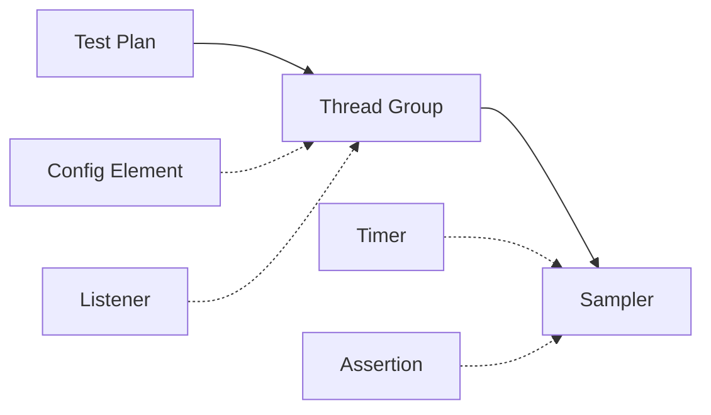

# JMeter Test Plan 구성 요소

## Test Plan의 개념

JMeter에서 **Test Plan(테스트 계획)**은 모든 테스트의 최상위 컨테이너이자, "무엇을, 어떻게, 얼마나" 테스트할지를 정의한 설계도 전체를 의미합니다.

쉽게 비유하자면, Test Plan은 하나의 **'프로젝트 파일'**이고, 그 안에 들어가는 Thread Group, Sampler 등이 구체적인 **'작업 지침'**들입니다.

---

## Test Plan 구조 다이어그램

### 기본 계층 구조

---

### 실행 흐름도

---

### 쇼핑몰 부하 테스트 시나리오

**시나리오 설명:**
- 100명 사용자 동시 접속
- 각 단계별 2~5초 대기 시간 적용
- IP: 13.125.xx.xx / PORT: 8080

---

### 구성 요소 관계도

**범례:**
- 실선: 필수 관계
- 점선: 선택적 관계

---

## 1. Test Plan의 주요 특징

- **최상위 레벨**: 모든 요소(Thread Group, Listener 등)는 반드시 Test Plan 아래에 위치해야 합니다.
- **파일 저장**: Test Plan을 저장하면 .jmx라는 확장자로 저장되며, 이 파일만 있으면 다른 PC에서도 동일한 테스트를 수행할 수 있습니다.
- **전역 설정**: 프로젝트 전체에 공통으로 적용될 변수나 설정을 여기서 관리합니다.

## 2. Test Plan 설정 화면의 핵심 항목

| 항목 | 설명 | 사용 예시 |
|------|------|----------|
| User Defined Variables | 전역 변수 선언 | IP=13.125.xx.xx |
| Run Thread Groups consecutively | 스레드 그룹 순차 실행 | 로그인 후 주문 순서 보장 |
| Functional Test Mode | 응답 데이터 전체 저장 | 디버깅 시에만 사용 |

## 3. 구성 요소 요약

| 구성 요소 | 역할 | 필수 여부 |
|----------|------|----------|
| Test Plan | 최상위 컨테이너 | 필수 |
| Thread Group | 가상 사용자 그룹 | 필수 |
| Sampler | 서버 요청 | 필수 |
| Config Element | 설정 | 선택 |
| Timer | 대기 시간 | 선택 |
| Assertion | 응답 검증 | 선택 |
| Listener | 결과 수집 | 선택 |

---

## 실습 팁: Test Plan 이름 짓기

실무에서는 Test Plan의 이름을 단순히 'Test Plan'으로 두지 않고, 명확하게 바꿉니다.

**네이밍 규칙:**
- 형식: ProjectName_TestType_Version
- 예: ShoppingMall_LoadTest_v1, PaymentAPI_StressTest_v2

왼쪽 트리 최상단의 Test Plan을 클릭하고 이름을 수정한 뒤 Ctrl + S를 눌러 저장해 보세요.
